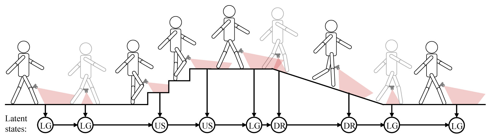

# Sequential decision fusion for environmental classification in assistive walking



This respiratory includes the code and data of our paper: Sequential decision fusion for environmental classification in assistive walking. 

Powered prostheses are effective for helping amputees walk in a single environment, but these devices are inconvenient to use in complex environments. In order to help amputees walk in complex environments, prostheses need to understand the motion intent of amputees. Recently, researchers have found that vision sensors can be utilized to classify environments and predict the motion intent of amputees. Although previous studies have been able to classify environments accurately in offline analysis, the corresponding time delay has not been considered. To increase the accuracy and decrease the time delay of environmental classification, the present paper proposes a new decision fusion method. The sequential decisions of environmental classification are fused by constructing a hidden Markov model and designing a transition probability matrix. Then the developed method is evaluated by inviting five able-bodied subjects and three amputees to perform indoor and outdoor walking experiments. The results indicate that the proposed method can classify environments with accuracy improvements of 1.01% (indoor) and 2.48% (outdoor) over the previous voting method when a delay of only one frame is incorporated. The present method also achieves higher classification accuracy than the recurrent neural network (RNN), long-short term memory (LSTM), and gated recurrent unit (GRU). When achieving the same classification accuracy, the method of the present paper can decrease time delay by 67 ms (indoor) and 733 ms (outdoor) in comparison to the previous voting method. Besides classifying environments, the proposed decision fusion method is also able to optimize the sequential predictions of the human motion intent and other sequential signals.


You can test the present hmm, rnn, lstm, and gru model directly by running the file: main_offline.py

## Run

```bash
python main_offline.py
```

## Prepare your own dataset

The input of the present method is a 2D time sequence (numpy array). The rows of the array are sorted by the capturing time, and the columns of the array are the classification probability on different categories. For calculating the classification accuracy, you can design a neural network and save the normalized classification scores from the last layer. You can look through my previous project (https://github.com/KuangenZhang/Environmental-classification)  to build a convolutional neural network to classify your signals. 

## Contact

For more related works and codes, please view my homepage: https://kuangenzhang.github.io/

Further information please contact Kuangen Zhang (kuangen.zhang@alumni.ubc.ca).

## Citation
If you find our work useful in your research, please consider citing:

K. Zhang, W. Zhang, W. Xiao, H. Liu, C. W. de Silva, and C. Fu, “Sequential decision fusion for environmental classification in assistive walking,” *arXiv:1904.11152 [cs]*, Apr. 2019.


## License
MIT License
